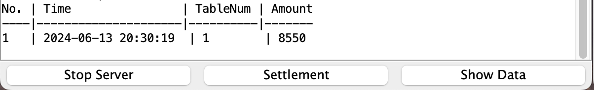

# README.md

> TCP를 활용하여 소켓통신을 구현하는 과제입니다.
> 
> Java를 사용하였고, GUI는 Java Swing을 사용하였습니다.
> 
> 프로그램의 목적은 클라이언트들의 주문을 서버가 받아들이고, DB에 저장하는 그런 프로그램을 만들어 봤습니다. 다중작업을 위해 쓰레드로 돌아갑니다
> 

> 개발환경: 
> 프로세서 : 3 GHz 6코어 Intel Core i5
>
> 그래픽: Radeon Pro 560X 4 GB
>
> 메모리 : 16GB 2667 MHz DDR4
>
> OS: macOS Sonoma 14.5 23F79
>
> Java : 21.0.2 2024-01-16 LTS (build 21.0.2+13-LTS-58)
>
> Javac: 21.0.2
> 

# Server:

실행중인 서버 사진 :


```bash
//server compile
java -cp ".:sqlite-jdbc-3.46.0.0.jar:slf4j-api-2.0.9.jar:slf4j-simple-2.0.9.jar" OrderServer

//server start
javac -cp ".:sqlite-jdbc-3.46.0.0.jar:slf4j-api-2.0.9.jar:slf4j-simple-2.0.9.jar" OrderServer.java

```

# client

실행중인 client사진


```bash
//compile client
javac OrderServer.java

//start OrderServer
java OrderServer
```

# DB연동



### 서로 다른 쓰레드를 갖고 있어 따로 처리되는 정보 사진


